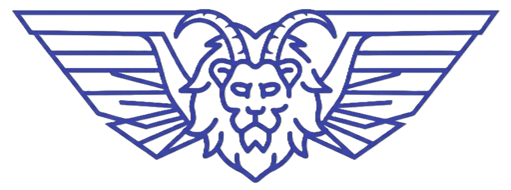
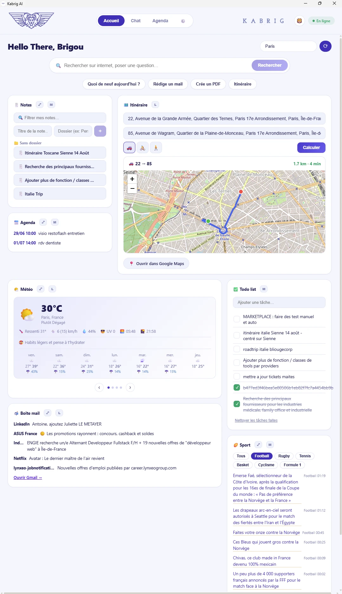
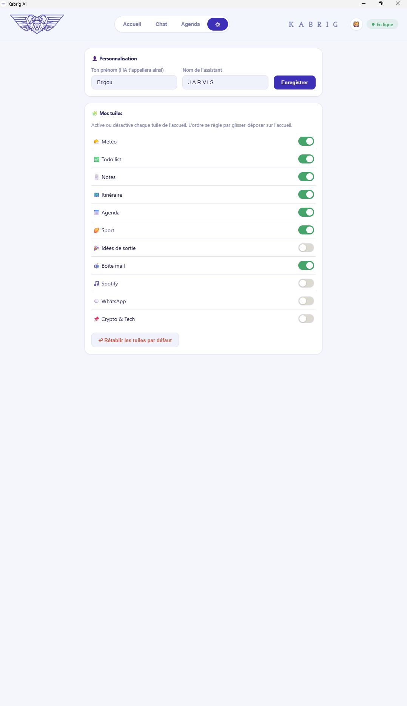
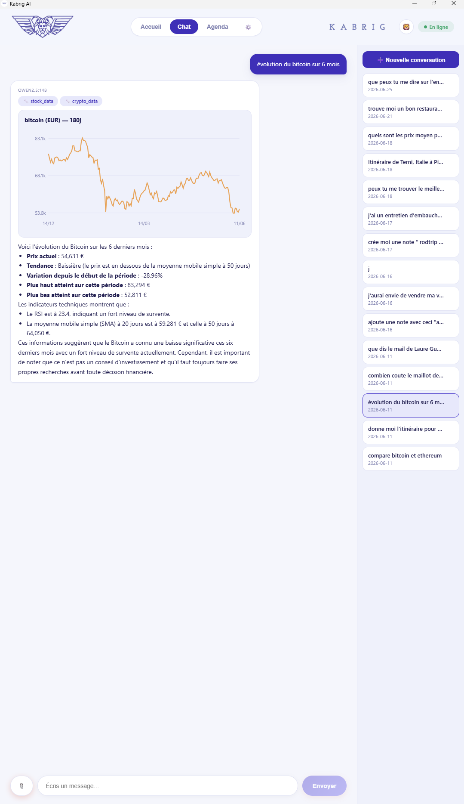

<div align="center">
  
  <h1>Kabrig AI</h1>
  <p><b>Assistant personnel de bureau type « JARVIS » — 100 % local, 100 % gratuit, 100 % privé.</b></p>
</div>

---

Kabrig est une application de bureau (Windows / macOS / Linux) qui combine deux LLM locaux (via [Ollama](https://ollama.com)) avec un **dashboard de tuiles personnalisable** et un **chat à outils**. Aucune donnée ne quitte ta machine : pas de clé API payante, pas de cloud.

## 📸 Aperçu

| Dashboard | Réglages | Chat (analyse financière) |
|:---:|:---:|:---:|
|  |  |  |

## ✨ Fonctionnalités

**Dashboard** — tuiles déplaçables (glisser-déposer), redimensionnables (S/M/L), activables/désactivables :
- 🌤️ **Météo** multi-villes en carrousel (recherche prédictive, prévisions 7 jours, conseils habillement/linge)
- ✅ **Todo list** · 🗒️ **Notes** avec sous-dossiers · 📅 **Agenda**
- 🗺️ **Itinéraire** (adresses précises, voiture/vélo/piéton, carte + lien Google Maps)
- 🏉 **Sport** (flux L'Équipe filtrable) · 🎉 **Idées de sortie** · 📬 **Mail** (Gmail) · 🎵 **Spotify** · 📌 **Tuiles d'actu personnalisées**
- 🔍 **Barre de recherche** : recherche web directe ou navigation intelligente vers une tuile
- Recherche prédictive, rafraîchissement auto, 3 thèmes (clair / sombre / bleu)

**Chat** — le LLM appelle des outils automatiquement :
- Météo, itinéraires, recherche internet + lecture de pages
- Notes, todo, agenda, préférences d'accueil
- **Analyse financière** (crypto via CoinGecko, bourse via Yahoo Finance, graphiques)
- **Création de documents** PDF / Word · **import & résumé** de fichiers (PDF, Word, Excel, txt…)
- **RAG** sur tes documents (ChromaDB + embeddings locaux)
- **Envoi d'emails** (avec confirmation) · graphiques · conversations sauvegardées

## 🧱 Stack

| | |
|---|---|
| **Frontend** | Tauri v2 · React · TypeScript · Vite |
| **Backend** | FastAPI · Python |
| **LLM** | Ollama — `qwen2.5:3b` (routeur rapide) + `qwen2.5:14b` (raisonnement) |
| **Données** | SQLite · ChromaDB · `nomic-embed-text` |
| **APIs gratuites** | Open-Meteo · Nominatim/OSRM · DuckDuckGo · CoinGecko · Yahoo Finance · L'Équipe RSS |

## 📦 Prérequis

- [Node.js](https://nodejs.org) ≥ 20 · [Rust](https://rustup.rs) · [Python](https://python.org) ≥ 3.11 · [Ollama](https://ollama.com)

## 🚀 Installation

```bash
# 1. Modèles Ollama
ollama pull qwen2.5:3b
ollama pull qwen2.5:14b
ollama pull nomic-embed-text

# 2. Backend
cd backend
python -m venv .venv
.venv\Scripts\pip install -r requirements.txt

# 3. Frontend
cd ../frontend
npm install
```

## ⚙️ Configuration (optionnelle)

Copie `backend/.env.example` en `backend/.env` et remplis ce dont tu as besoin :

```ini
# Lecture / envoi d'emails (mot de passe d'application Google)
GMAIL_ADDRESS=...
GMAIL_APP_PASSWORD=...

# Contrôle Spotify (https://developer.spotify.com/dashboard)
# Redirect URI à enregistrer : http://127.0.0.1:8000/callback
OAUTH_SPOTIFY_CLIENT_ID=...
```

> Le reste des fonctionnalités marche **sans aucune clé**.

## ▶️ Lancer

**En développement :**
```bash
# Terminal 1 — backend
cd backend && .venv\Scripts\uvicorn app.main:app --reload --port 8000
# Terminal 2 — app
cd frontend && npx tauri dev
```

**En application de bureau (Windows) :**
```bash
cd frontend && npx tauri build      # génère frontend/src-tauri/target/release/app.exe
```
Puis double-clic sur le raccourci `Kabrig` (créé via `launch-kabrig.ps1`). L'app **démarre et arrête le backend toute seule**.

## 🏗️ Architecture

```
KabrigAI/
├── backend/app/        FastAPI — tools, routing 2-LLM, RAG, finance, agenda, notes…
├── frontend/src/       React — dashboard à tuiles, chat, widgets (météo/carte/graphique)
│   └── src-tauri/      Tauri (Rust) — fenêtre, tray, Ctrl+Espace, gestion du backend
└── launch-kabrig.ps1   Lanceur desktop (Ollama + app)
```

Le **routeur** dirige chaque requête vers le petit modèle (rapide) ou le gros (raisonnement) par mots-clés, et n'envoie au LLM que les **outils pertinents** pour accélérer.

## 🔒 Vie privée

Tout tourne **en local** : LLM, base de données, documents, embeddings. Tes secrets (`.env`, tokens, données) sont exclus du dépôt.

## ⚡ Note matériel

Optimisé pour une machine modeste (testé sur AMD Radeon RX 6600 + 32 Go RAM). Sur GPU AMD/Windows, exporte `HSA_OVERRIDE_GFX_VERSION=10.3.0` pour de meilleures performances Ollama.
